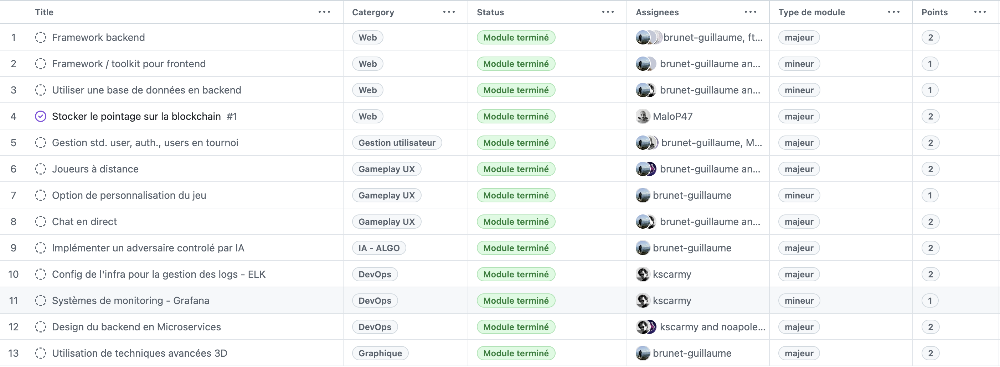
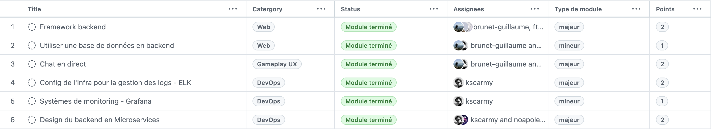

# <center>ft_transcendence</center>


## Introduction

`ft_transcendence` est le projet final du cursus 42. Il vise à créer une plateforme web interactive pour jouer au jeu Pong en ligne, incluant des fonctionnalités multijoueurs en temps réel, des tournois, et des options avancées via des modules spécifiques.\
Ce projet respecte les contraintes techniques strictes tout en mettant en avant des choix technologiques justifiés et une architecture moderne.

Mon rôle, a été de contribuer aux aspects DevOps, notamment la gestion des logs avec ELK, la mise en place de systèmes de monitoring avec Grafana, et la conception du backend en microservices.\

Ce README détaille le projet, ses fonctionnalités et les technologies utilisées.

## Table des matières

- [Introduction](#introduction)
- [Fonctionnalités principales](#fonctionnalités-principales)
- [Technologies utilisées](#technologies-utilisées)
- [Modules implémentés](#modules-implémentés)
  - [Partie obligatoire](#partie-obligatoire)
  - [Web](#web)
  - [Gestion Utilisateurs](#gestion-utilisateurs)
  - [Gameplay UX](#gameplay-ux)
  - [IA - Algo](#ia---algo)
  - [DevOps](#devops)
  - [Graphiques](#graphiques)
- [Installation](#installation)
  - [Prérequis](#prérequis)
  - [Étapes](#étapes)
- [Utilisation](#utilisation)
- [Contributions](#contributions)
- [Licence](#licence)
- [Captures d’écran](#captures-décran)
- [Exemple de configuration `.env`](#exemple-de-configuration-env)
- [Gestion avec Makefile](#gestion-avec-makefile)

## Fonctionnalités principales

- **Jeu Pong en temps réel** : Implémentation du jeu Pong, avec des parties multijoueurs en ligne.
- **Interface utilisateur** : Application web monopage (SPA) compatible avec Google Chrome.
- **Tournois** : Organisation de tournois, avec un système de matchmaking automatisé.
- **Déploiement simplifié** : Lancement via des commandes gérées par un `Makefile`.

## Technologies utilisées


- **Frontend** : Django (Python), JavaScript, TypeScript, Bootstrap.
- **Backend** : Django.
- **Base de Données** : PostgreSQL.
- **Stockage Blockchain** : Ethereum et Solidity.
- **Conteneurisation** : Docker et docker-compose, avec des conteneurs autonomes et des configurations rootless pour la sécurité.
- **Sécurité** : Chiffrement des mots de passe, protection contre les injections SQL/XSS, HTTPS obligatoire.
- **DevOps** : 
  - **ELK** : Elasticsearch, Logstash, Kibana - gestion des Logs.
  - **Grafana et Prometheus** : Monitoring.
  - **Architecture microservices** : pour le Backend.

## Modules implémentés


Les modules ci-dessous ont été implémentés par l’équipe, comme visible dans le suivi du projet GitHub ([voir ici](https://github.com/users/MaloP47/projects/4/views/1)).



Mes parties


### Partie obligatoire

- **Jeu Pong** : Implémentation complète avec deux joueurs en temps réel sur le même clavier (JavaScript natif).
- **Tournoi** : Système de matchmaking et gestion des aliases réinitialisables.
- **Contraintes techniques** : Application monopage, navigation avec boutons Précédent/Suivant, aucune erreur non gérée.


### Web

1. **Framework backend**
	- Django a été choisi pour sa robustesse et sa rapidité de mise en place, tout en respectant des contraintes de sécurités.
2. **frontend : Framework / Toolkit**
	- Bootstrap a été utilisé pour un design responsive et rapide à implémenter.
3. **Base de Données en Backend**
	- PostgreSQL garantit la cohérence des données et la compatibilité entre tous les composants du projet
4. **Stockage Blockchain**
	- Mise en œuvre d’une fonctionnalité au sein du site Pong pour stocker de manière sécurisée les scores des tournois sur une blockchain. À des fins de développement et de test, nous utilisons un environnement de blockchain de test. La blockchain choisie pour cette implémentation est Ethereum, et le langage de programmation utilisé pour le développement de contrats intelligents est Solidity.

### Gestion Utilisateurs
1. **Gestion utilisateurs standard**  
   - Inscription, Authentification Sécurisée, Profils, Avatars, Statistiques...
   - Utilisation de Django pour une gestion efficace et sécurisée des données utilisateurs.

### Gameplay UX
1. **Joueurs à distance**  
   - Permet des parties à distance en gérant les latences et déconnexions pour une meilleure expérience utilisateur.
2. **Option de personnalisation du jeu**  
   - Ajout de bonus (power-ups) et options visuelles. 
   - Amélioration de l’expérience utilisateur tout en restant relastivement simple à intégrer.
3. **Chat en direct**   
   - Ajout d’un système de messagerie en temps réel. Possibilités de : MP, Bloquer, Ajouter un ami, Inviter à jouer...

### IA - Algo
1. **Adversaire contrôlé par IA**
	- Integration d'un adversaire contrôlé par IA qui simule un comportement humain en interagissant via des entrées clavier et en actualisant sa perception du jeu une fois par seconde. L’IA doit être capable de prendre des décisions stratégiques, d’anticiper les mouvements, d’utiliser des bonus et de s’adapter aux scénarios du jeu, sans utiliser l’algorithme A*. L'IA doit être compétitive pour gagner des parties.

### DevOps
1. **Infrastructure gestion des logs – ELK**
   - Mise en place d’une infrastructure robuste avec ELK pour collecter, traiter et visualiser les logs, facilitant le dépannage et la surveillance.
2. **Monitoring – Grafana et Prometheus**
   - Déploiement de Grafana avec Prometheus pour une surveillance en temps réel des performances et détection proactive des problèmes, avec système notifications.
3. **Design du backend en Microservices**
   - Adoption d’une architecture microservices pour une meilleure flexibilité, scalabilité et maintenabilité du backend, avec API RESTful.

### Graphiques
1. **Utilisation de techniques avancées 3D**  
   - Amélioration visuelle avec ThreeJS/WebGL pour une expérience immersive en 3D.


## Installation

Pour lancer le projet localement :

### Prérequis
   - Docker et Docker Compose installés.
   - Git pour cloner le dépôt.
   - Minimum 4Go de RAM, 8Go recommandés.

	| OS | Distribution | Architecture | Support |
	| --- | --- | --- | --- |
	| Linux | Debian | x86 | ✅ |
	| Linux | Debian / ARMbian | xARM | ✅ >=8Go Ram |
	| Linux | Ubuntu / Xubuntu | x86 | ✅ |
	| MacOS | Sequoia 15.2 | Apple ARM | ✅ |
	| Windows | 10 / 11 | x86 | ❌ non testé |


### Étapes
- Clone le dépôt

	```bash
	git clone https://github.com/kscarmy/42.ft_transcendence.git
	cd 42.ft_transcendence
	```

- Créer le fichier des Variables d'Environnement `.env` :
	```bash
	touch .env
	```

- Insérer les Variables d'Environnement dans `.env`
	```plaintext
	# POSTGRES_HOST_AUTH_METHOD=trust
	POSTGRES_USER=postgres             
	POSTGRES_PASSWORD=postgres
	POSTGRES_DB=postgres
	POSTGRES_HOST=postgres
	POSTGRES_PORT=5432
	POSTGRES_ENGINE="django.db.backends.postgresql"

	#grafana
	GF_SECURITY_ADMIN_USER=grafana
	GF_SECURITY_ADMIN_PASSWORD=adminpassword123
	GF_SERVER_ROOT_URL=%(protocol)s://%(domain)s:%(http_port)s/grafana/
	GF_SERVER_SERVE_FROM_SUB_PATH=true

	# Discord alerts
	DISCORD_WEBHOOK="https://discord.com/api/webhooks/1251195705301667872/KCoPeQygUtFXvGd-8g6_i7G16lnJ7414di6uaYVygTbgyBNSl4wyqdw8-zWNgGgqDwBQ"

	# elasticsearch
	ELASTIC_USERNAME=elastic
	ELASTIC_PASSWORD=DidierDidier
	bootstrap.memory_lock=true
	discovery.type=single-node
	xpack.security.enabled=true
	xpack.monitoring.collection.enabled=true
	xpack.security.http.ssl.enabled=false

	# logstash
	xpack.monitoring.enabled=true

	# Blockchain settings
	API_URL="https://eth-sepolia.g.alchemy.com/v2/4uryTCcwOBqa6dyrL9ajVJiTblBGXYgW"
	PRIVATE_KEY="a5fd090aae2bfd9bf0b1bc3bef44dcbaaabc2681f891da32edbbfe5cc05ce5b5"
	API_KEY="4uryTCcwOBqa6dyrL9ajVJiTblBGXYgW"
	CONTRACT_ADDRESS="0x2971a35217A1c844C18aF535FbeC63d8A097760F"
	ETHERSCAN_API_KEY="7KBZM4CKIPXNYN36BW1IC9BN94XA5R5D74"

	# Django secret key
	DJANGO_SECRET_KEY='ebL1UDQ:Dt2i2l2UvsJ3A@s=/t8[..:£2}",eRGg|7ie=^=M5u'

	# SuperUser
	SUPERUSER_ID='admin'
	SUPERUSER_PASSWORD='02y5zTF#1{_~2['
	```

- Lancer le projet :
	```bash
	make
	```
	Faites vous un café au premier lancement, ce peut etre long...

- Arreter le projet :
	```bash
	make stop
	```

- Supprimer les installations (ne supprime pas le depot) :
	```bash
	make fclean
	```

- Aide :
	```bash
	make help
	```

- Accédez au site via `https://localhost:1443`.

 **Remarque** : Les variables d’environnement (clés API, mots de passe) qui sont stockées dans le fichier `.env` sont ignoré par Git pour des raisons de sécurité. Dans le cadre de la démonstration du README, on les fournis dans afin de tester le porojet.

## Utilisation

- **Jouer à Pong** : Créez un Compte, Connectez-vous et Créez / Rejoingnez une partie ou un tournoi !
- **Tournois** : Inscrivez-vous et laissez le système de matchmaking organiser les matchs.
- **Personnalisation** : Accédez aux options de personnalisation (bonus, visuels) dans le menu du jeu.
- **Chat** : Utilisez le chat en direct pour communiquer avec d’autres joueurs ou les inviter à une partie.
- **Monitoring** : Consultez les logs via ELK et les métriques via Grafana pour surveiller le système.

## Contributions

Ce projet a été réalisé en équipe. Les contributions sont visibles dans l’historique Git et le suivi des tâches ([GitHub Projects](https://github.com/users/MaloP47/projects/4/views/1)).

Ouvert aux contributiuons 🙂


## Licence

Pas encore fait
<!-- Ce projet est sous licence [MIT](LICENSE) – voir le fichier `LICENSE` pour plus de détails. -->

## Captures d’écran

Actuellement pas encore intégrés au `README.md`, voir dans `./docs/` pour les captures d'écran.


## Auteurs

Projet réalisé par :
- [kscarmy](https://github.com/kscarmy)
- [MaloP47](https://github.com/MaloP47)
- [noapoleon](https://github.com/noapoleon)
- [ftrenstein](https://github.com/ftrenstein)
- [brunet-guillaume](https://github.com/brunet-guillaume)